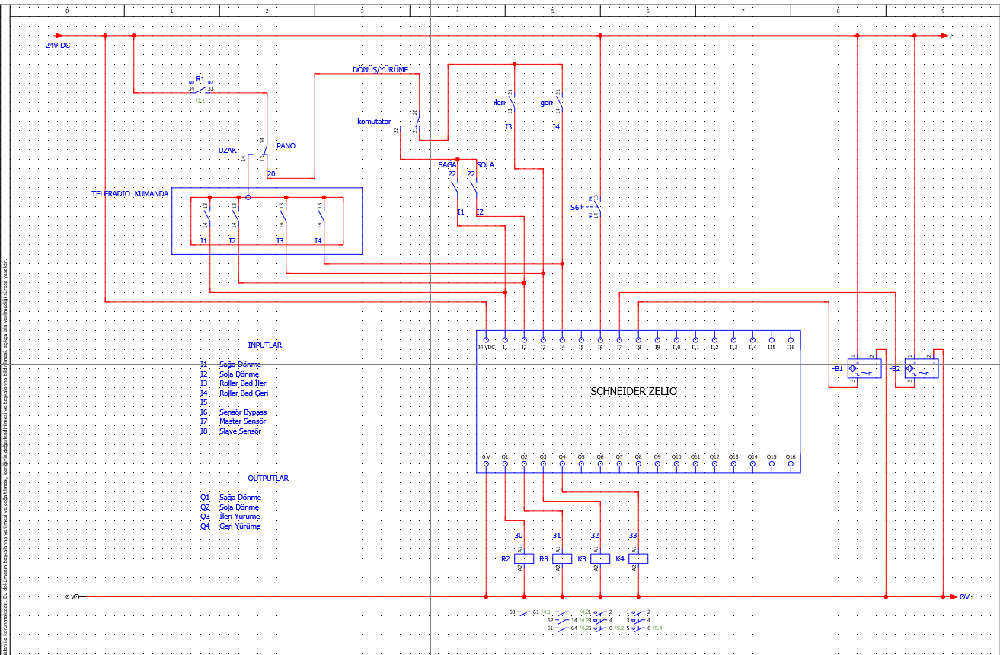
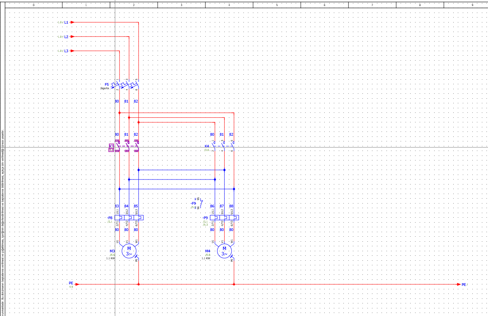
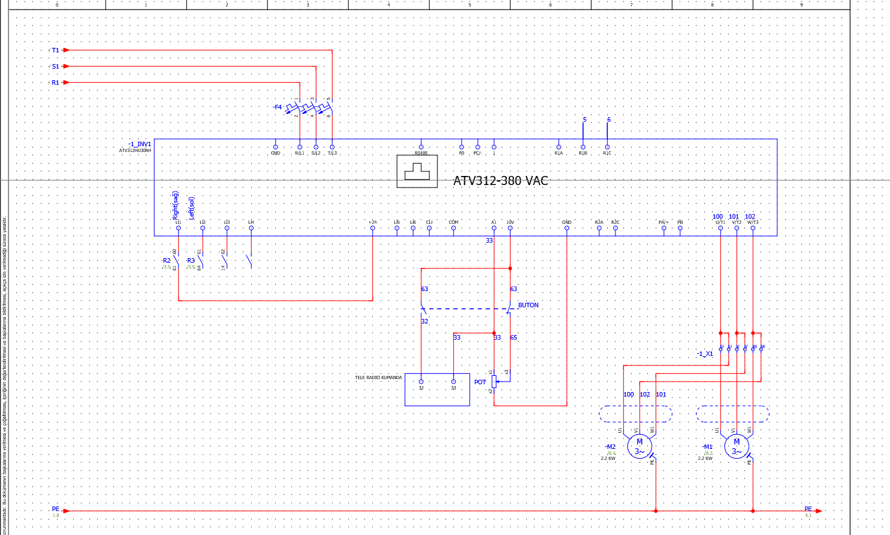
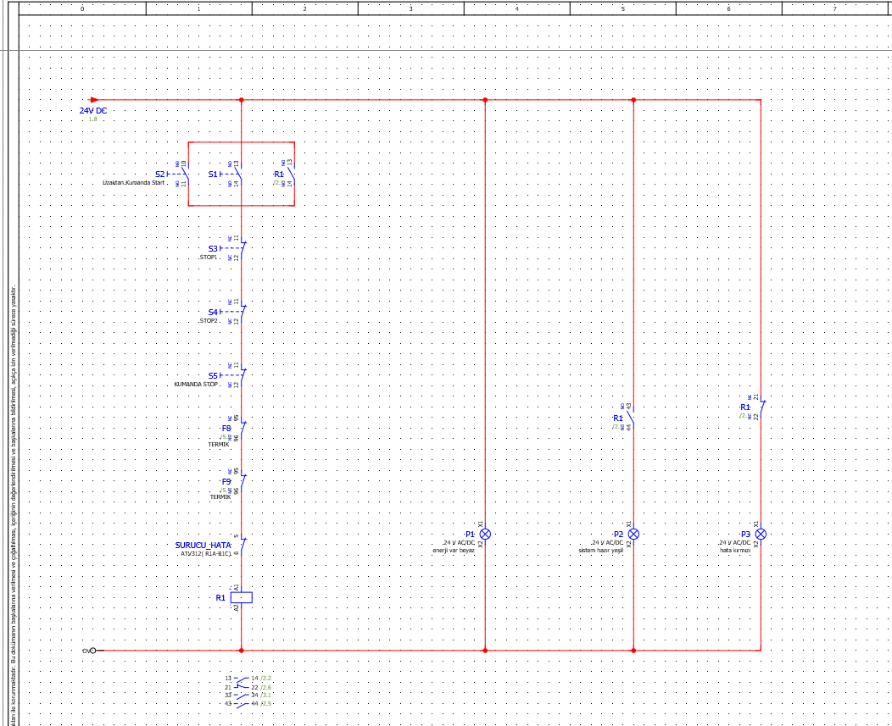
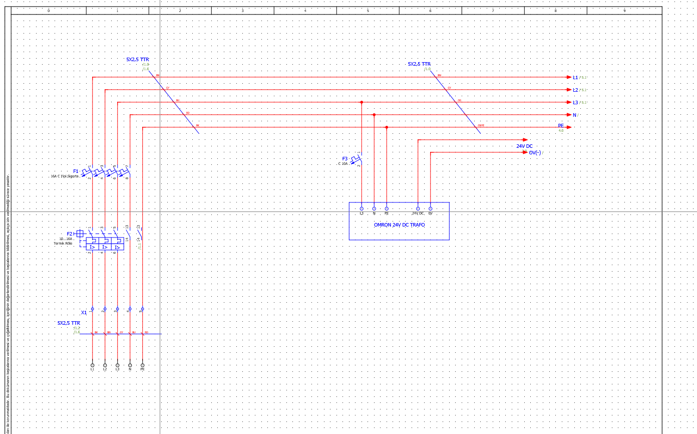
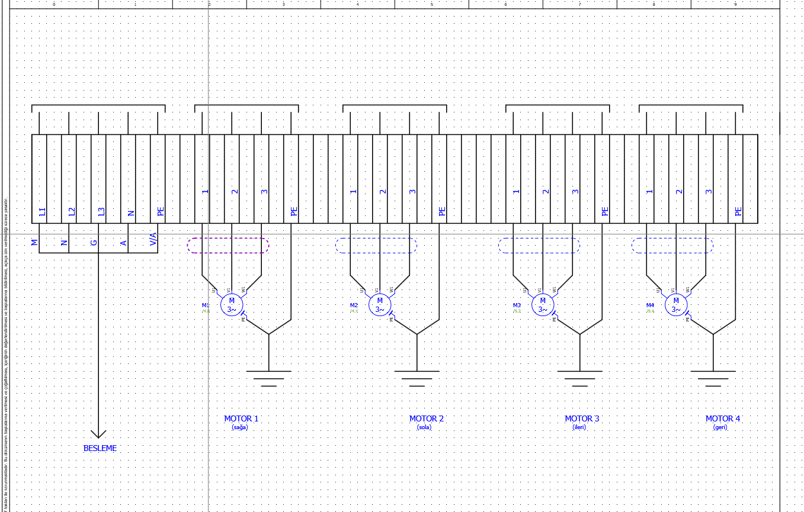

# Zelio Roller Bed Control

EPLAN Electric P8 kullanılarak hazırlanan Roller Bed elektrik ve kontrol sistemi projesidir. Sistem, dört adet motorun sağa, sola, ileri ve geri hareketlerinin kontrol edilmesi amacıyla tasarlanmıştır.

## Proje İçeriği

- Schneider Zelio akıllı röle ile kontrol
- 4 adet üç fazlı motor
- Sağa ve sola dönüş kontrolü
- İleri ve geri hareket kontrolü
- Schneider ATV312 frekans konvertörü
- 24 V DC kontrol devresi
- Kontaktör ve termik röle devreleri
- Start/Stop ve uzaktan kumanda kontrolü
- Sensör girişleri
- Motor güç ve kumanda devreleri
- EPLAN elektrik şemaları

## Kullanılan Yazılım ve Ekipmanlar

- EPLAN Electric P8
- Schneider Zelio Logic
- Schneider ATV312
- Kontaktörler
- Termik röleler
- 24 V DC güç kaynağı
- Üç fazlı asenkron motorlar
- Sensörler

## Proje Görselleri

### Zelio Kontrol Devresi

### Motor Güç Devresi

### ATV312 Motor Kontrolü

### Kumanda Devresi

### Güç Besleme Devresi

### Motor Bağlantıları

